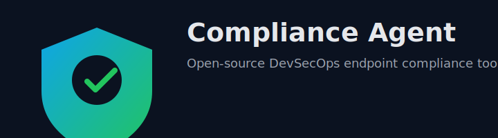

<p align="center">
  
</p>

## Compliance Agent

Compliance Agent is an open-source DevSecOps endpoint compliance tool written in Go. It automatically collects system and security telemetry (with or without osquery), evaluates simple compliance policies (e.g., allowed users and ports), and generates structured JSON reports. **Single-click execution** - no manual setup required!

<p align="center">
  <a href="https://go.dev/"></a>
  <a href="LICENSE"></a>
  <a href="Dockerfile"></a>
  <a href="https://github.com/jaykumar/endpoint-compliance-agent/pulls"></a>
</p>

### Features
- **🚀 Single-Click Execution**: No manual setup required - just run and go!
- **🔧 Auto-Setup**: Automatically installs and configures osquery if available
- **🛡️ Fallback Collection**: Works without osquery using native system commands
- **📊 Comprehensive Data**: Collects users, processes, open ports, and installed packages
- **⚖️ Policy Evaluation**: Evaluates data against configurable compliance policies
- **📄 JSON Reports**: Generates structured reports saved to `compliance_report.json`
- **🔌 Modular Design**: Prepared for extensions (alerting, HTTP shipping, Docker)

### Architecture
- `collector/osquery.go`: osquery-based system data collection with auto-setup
- `collector/fallback.go`: native system command fallback collection
- `analyzer/compliance.go`: policy definitions and evaluation logic
- `report/report.go`: JSON report struct, serialization, and file write helper
- `main.go`: orchestrates collection → analysis → report with smart fallback

### Prerequisites
- **Go 1.22+** (only requirement!)
- **Optional**: osquery for enhanced data collection
  - Agent will auto-install osquery if available
  - Falls back to native system commands if osquery unavailable
  - Override socket path with `OSQUERY_SOCKET` env var

### Usage

#### 🚀 Single-Click Execution (Recommended)
```bash
# Clone and run immediately - no setup required!
git clone https://github.com/jaykumar/endpoint-compliance-agent.git
cd endpoint-compliance-agent
go run ./...
```

#### 📦 Build and Run
```bash
# Build the binary
go build -o compliance-agent

# Run the binary
./compliance-agent
```

#### ⚙️ Environment Configuration (Optional)
- `OSQUERY_SOCKET`: Path to osquery extension socket (default `/var/osquery/osquery.em`)

#### 🔄 What Happens When You Run
1. **Auto-Detection**: Checks if osquery is available and running
2. **Auto-Setup**: Attempts to install osquery via package manager (Homebrew/apt/yum)
3. **Smart Fallback**: Uses native system commands if osquery unavailable
4. **Data Collection**: Gathers users, processes, ports, and packages
5. **Compliance Check**: Evaluates against configurable policies
6. **Report Generation**: Saves JSON report to `compliance_report.json`

### Output
The agent prints collected data and violations to stdout and writes a JSON report to `compliance_report.json`, for example:
```json
{
  "generated_at": "2025-09-22T10:00:00Z",
  "hostname": "host.example",
  "users": [ {"username": "root", "uid": "0" } ],
  "processes": [ ... ],
  "open_ports": [22, 80],
  "packages": [ {"name": "bash", "version": "5.2" } ],
  "violations": [ {"category": "user", "message": "unexpected user present: test"} ]
}
```

### Docker
Build the container image:
```bash
docker build -t compliance-agent .
```

Note: To use osquery inside containers, you typically need to run osquery on the host and provide access to its socket. Containerized usage may require additional configuration depending on your environment.

### Why Compliance Agent?
- **🎯 Zero-Config**: Works out of the box with no manual setup
- **🔄 Smart Fallback**: Gracefully handles missing dependencies
- **📊 Rich Data**: Comprehensive system telemetry via osquery or native commands
- **🔗 Easy Integration**: Structured JSON outputs ready for SIEM/ELK
- **⚡ Fast Execution**: Lightweight and efficient data collection
- **🛠️ Extensible**: Modular design for easy feature additions

### Roadmap
- **🌐 HTTP Exporter**: Send reports to central services
- **🚨 Alerting**: Slack, email, SIEM integrations
- **🔍 Enhanced Collectors**: Firewall rules, deeper package metadata, OS hardening
- **🌍 Cross-Platform**: Windows support, additional Linux distributions
- **🤖 ML Integration**: Anomaly detection and behavioral analysis
- **📈 Dashboard**: Web UI for compliance monitoring

### Contributing
Contributions are welcome! Please open an issue to discuss significant changes. For small fixes and improvements:
1. Fork the repo
2. Create a feature branch
3. Commit with clear messages
4. Open a PR against `main`

### License
MIT


