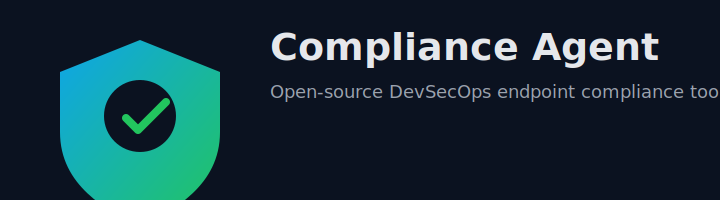

<p align="center">
  
</p>

## Endpoint UEBA + Compliance Agent

An open-source **endpoint UEBA agent** in Go with a Python ML scorer (FastAPI + IsolationForest). The agent collects rich host telemetry, learns a per-host baseline of "normal" behavior over time, scores each snapshot through a pluggable ML pipeline, and routes high-scoring snapshots to Slack alerts and structured reports. Deterministic compliance rules (allowed users / ports) live alongside the ML scorer as a complementary rule layer — so the same agent gives you both **behavioral anomaly detection** and **policy compliance** in one binary.

<p align="center">
  <a href="https://go.dev/"></a>
  <a href="https://www.python.org"></a>
  <a href="ml_service/"></a>
  <a href="LICENSE"></a>
  <a href="Dockerfile"></a>
</p>

### Features
- **🧠 ML-Based UEBA Scoring**: 10-feature behavioral anomaly score per snapshot, calibrated to [0, 1]
- **📚 Per-Host Baseline Learning**: rolling reservoir of process / port / user / package frequencies, persisted as JSON
- **🔁 Heuristic Fallback**: Go agent and Python ML service share an identical heuristic so the system never silently returns nonsense during cold start
- **♻️ Streaming Mode**: continuous snapshot loop with `/report` and `/healthz` HTTP exporter
- **🛰️ Train-Serve Symmetry**: the Go feature builder and Python `FEATURE_ORDER` are kept in lockstep — no skew between training and online scoring
- **📊 Rich Telemetry**: users, processes, ports, packages, network counters, system load — all in one snapshot
- **⚖️ Compliance Rules**: deterministic policy layer for allowed users and ports (complements the ML scorer)
- **🚨 Slack Alerts**: rich attachments with violation summary and ML anomaly score
- **🚀 Single-Click Execution**: works out-of-the-box; auto-installs osquery when available, falls back to native system commands otherwise

### Architecture

```
   ┌──────────────────────────────────────────────────────────────┐
   │                  compliance-agent (Go)                       │
   │                                                              │
   │  collector/  ─►  baseline/  ─►  ml/features.go ─►  ml/scorer │
   │  (osquery,        (rolling      (10-dim vec)       (heuristic│
   │   fallback,        per-host                         OR HTTP) │
   │   network,         JSON store)                               │
   │   sysmetrics)                                                │
   │                                                              │
   │       analyzer/compliance.go  ─►  report + alerting/Slack    │
   │       (deterministic rules)        + exporter (/report)      │
   └────────────────────────────────┬─────────────────────────────┘
                                    │ HTTP /score
                                    ▼
                    ┌───────────────────────────────┐
                    │   ml_service (Python)         │
                    │   FastAPI + IsolationForest   │
                    │   /score  /metrics  /healthz  │
                    └───────────────────────────────┘
```

Module map:

- **`ml/`** — feature builder + HTTP scorer client + shared heuristic
- **`ml_service/`** — Python FastAPI scorer (IsolationForest, StandardScaler)
- **`baseline/`** — rolling per-host frequency store, JSON-backed
- **`mode/streaming.go`** — continuous snapshot loop for live UEBA
- **`exporter/http.go`** — `/report` and `/healthz` HTTP surface
- **`collector/{osquery,fallback,network,sysmetrics}.go`** — telemetry sources
- **`analyzer/compliance.go`** — deterministic policy rules (allowed users/ports)
- **`config/`** — YAML configuration loader
- **`alerting/slack.go`** — Slack webhook integration
- **`report/report.go`** — structured JSON report

### MLE workflow

```bash
# 1. Run the agent in streaming mode to seed snapshots into a JSONL file
./compliance-agent --config configs/agent.yaml --streaming

# 2. Train the UEBA model on the collected feature vectors
python3 -m ml_service.train --features snapshots.jsonl --out models/ueba.joblib

# 3. Serve the trained model
docker compose up ml-service

# 4. Restart the agent — it'll now call the ML scorer instead of the heuristic.
#    Snapshots above the threshold flow into Slack alerts and the JSON report.
```

See [`docs/ARCHITECTURE.md`](docs/ARCHITECTURE.md) for the feature schema
and [`docs/MODEL_CARD.md`](docs/MODEL_CARD.md) for the model contract.

### Prerequisites
- **Go 1.22+**
- **Python 3.10+** (only for the optional `ml_service`)
- **Optional**: osquery for richer telemetry; auto-installed when missing, falls back to native commands otherwise

### Quick start

#### One-shot mode (default — collect once and exit)
```bash
git clone https://github.com/jayy-77/endpoint-compliance-agent.git
cd endpoint-compliance-agent
go run ./...
```

#### Streaming mode (continuous UEBA loop)
```bash
go build -o compliance-agent
./compliance-agent --config configs/agent.yaml --streaming
```

#### Full stack with ML service (docker-compose)
```bash
docker compose up
# agent on :9100 (/report), ml-service on :8000 (/score)
```

#### Slack test
```bash
export SLACK_WEBHOOK_URL="https://hooks.slack.com/services/YOUR/WEBHOOK/URL"
go run . -test-slack
```

### Output
The agent prints collected data and violations to stdout and writes a JSON
report to `compliance_report.json`. The new `meta.ml` block carries the
behavioral score, the model that produced it, and the feature vector for
downstream SIEM rules:

```json
{
  "generated_at": "2026-04-08T14:31:09Z",
  "hostname": "host.example",
  "users": [ { "username": "root", "uid": "0" } ],
  "processes": [ ... ],
  "open_ports": [22, 80],
  "violations": [ { "category": "user", "message": "unexpected user present: test" } ],
  "meta": {
    "ml": {
      "score": 0.82,
      "model": "IsolationForest",
      "threshold": 0.7,
      "anomaly": true,
      "features": {
        "process_count": 142,
        "unique_processes": 38,
        "unknown_process_ratio": 0.13,
        "open_port_count": 12,
        "unknown_port_ratio": 0.25,
        "user_count": 5,
        "pkg_count": 412,
        "process_count_zscore": 1.8,
        "user_count_zscore": 0.4,
        "pkg_count_zscore": 0.9
      }
    }
  }
}
```

### Configuration
A YAML file controls everything; defaults work without one. Example
`configs/agent.yaml`:

```yaml
mode: streaming
interval: 60s
baseline:
  path: /var/lib/compliance-agent/baseline.json
ml:
  url: http://ml-service:8000/score
  timeout: 2s
  threshold: 0.7
exporter:
  enabled: true
  addr: ":9100"
```

Environment overrides (useful for containers):
`ML_SERVICE_URL`, `SLACK_WEBHOOK_URL`, `SLACK_CHANNEL`, `EXPORTER_ENABLED`, `EXPORTER_ADDR`, `OSQUERY_SOCKET`.

### CI
GitHub Actions runs `go vet ./...`, `go test ./...`, `go build`, and a
Python smoke import for the ML service on every push.

### Why this design
- **Per-host baseline, not population**: UEBA models that pool data across hosts wash out per-host signal; this one keeps each host's normal separate.
- **Heuristic ↔ ML parity**: the Go-side heuristic and the Python service's fallback are bit-for-bit equivalent, so cold-start scores are calibrated the same way as warm-start scores.
- **One binary, two layers**: deterministic compliance rules (auditable, regulatable) and probabilistic ML scoring (catches novel behaviors) live in the same report, so a SOAR rule can branch on either or both.

### Roadmap
- **🌐 HTTP shipping**: forward reports to a central SIEM
- **🔍 Richer collectors**: firewall rules, deeper package metadata, OS hardening
- **🌍 Cross-platform**: Windows support, more Linux distros
- **🧪 Online learning**: river/streaming IsolationForest variant in the ML service
- **📈 Web dashboard**: Grafana panels off `/metrics`

### Contributing
Contributions welcome. For non-trivial changes, open an issue first.
1. Fork
2. Branch
3. Commit
4. PR against `main`

### License
MIT
